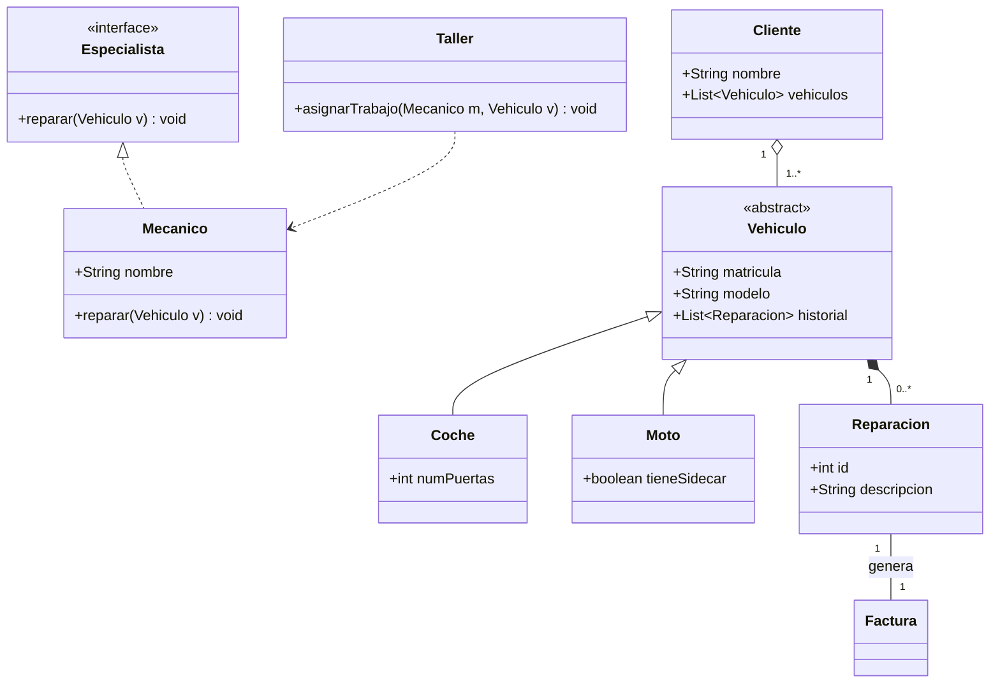

# Diseño del Sistema - Taller MerceDAWs

```mermaid
classDiagram
    class Especialista {
        <<interface>>
        +reparar(Vehiculo v) void
    }
    class Mecanico {
        +String nombre
        +reparar(Vehiculo v) void
    }
    class Cliente {
        +String nombre
        +List~Vehiculo~ vehiculos
    }
    class Vehiculo {
        <<abstract>>
        +String matricula
        +String modelo
        +List~Reparacion~ historial
    }
    class Coche { +int numPuertas }
    class Moto { +boolean tieneSidecar }
    class Reparacion {
        +int id
        +String descripcion
    }
    class Taller {
        +asignarTrabajo(Mecanico m, Vehiculo v) void
    }

    Especialista <|.. Mecanico
    Cliente "1" o-- "1..*" Vehiculo
    Vehiculo <|-- Coche
    Vehiculo <|-- Moto
    Vehiculo "1" *-- "0..*" Reparacion
    Taller ..> Mecanico

    Reparacion "1" -- "1" Factura : genera
```
