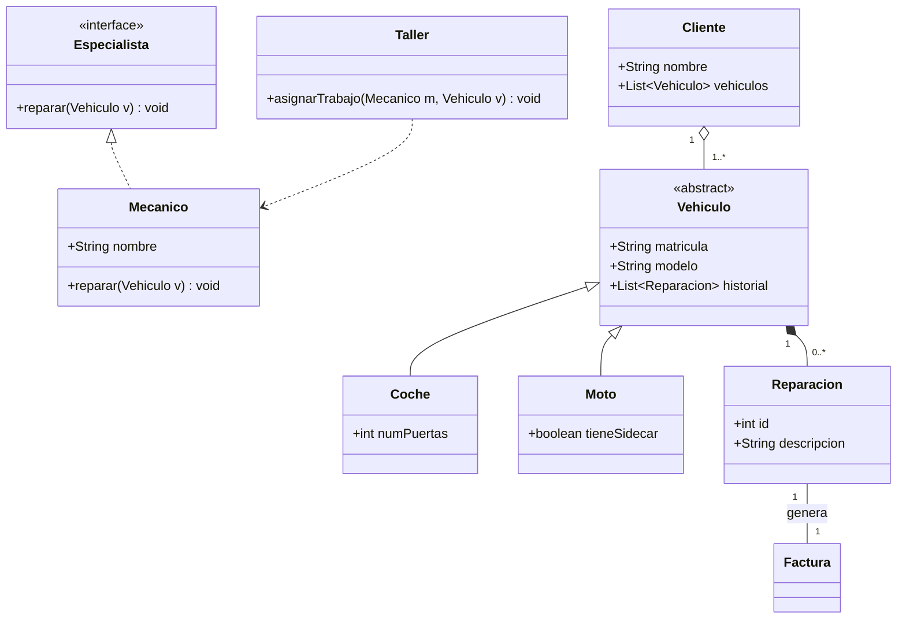

# 6.3.-Actividad-Diagrama-de-clases

## Justificación de Relaciones
* **Composición (Vehículo-Reparación):** He usado composición porque una reparación no existe fuera del contexto de un vehículo. Si eliminamos un vehículo del sistema, su historial de reparaciones se elimina con él.
* **Interfaz Especialista:** El uso de la interfaz permite que el `Taller` pueda trabajar con cualquier entidad que sepa reparar, facilitando el mantenimiento y permitiendo añadir nuevos tipos de mecánicos sin cambiar la lógica principal.

## Ingeniería Inversa
UML

